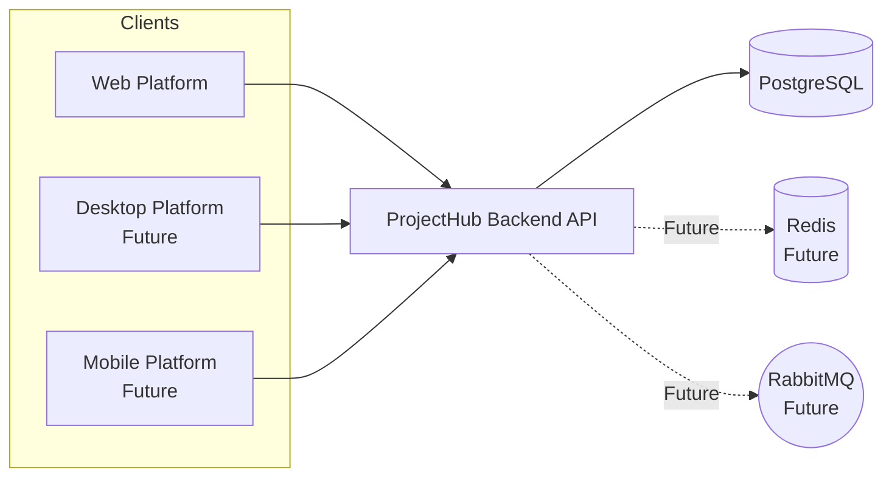

# ProjectHub Backend Architecture

> [!NOTE]
> This document defines the overall backend architecture of ProjectHub. It serves as the single source of truth for architectural decisions, system boundaries, technology choices, and development guidelines throughout the project lifecycle.

---

|**Project**     |ProjectHub           |
|----------------|---------------------|
|**Document**    |Backend Architecture |
|**Version**     |1.0.0                |
|**Status**      |Draft                |
|**Owner**       |Ngo Hoang Sang       |
|**Created**     |2026-07-06           |
|**Last Updated**|2026-07-06           |

---

## Table of Contents

1. Introduction
2. Project Goals
3. Architecture Style
4. High-Level Architecture
5. Solution Architecture
6. Layer Responsibilities
7. Module Design
8. Request Lifecycle
9. Data Flow
10. Dependency Rules
11. Design Principles
12. Cross-Cutting Concerns
13. Technology Stack
14. Scalability Strategy
15. Development Guidelines
16. Future Evolution

---

# 1. Introduction

> [!IMPORTANT]
> This section introduces the ProjectHub platfrom, explains the purpose of backend, defines the target audience, and establishes the scope of this architecture document.

## 1.1 Overview

ProjectHub is a cloud-native SaaS Project Management and Team Collaboration Platform designed to help individuals, teams, and organizations organize projects, manage tasks, and collaborate within a shared workspace.

The platform aims to provide a simple and centralized environment where users can plan work, monitor project progress, and collaborate more effectively without relying on multiple disconnected tools.

The first version of ProjectHub focuses on delivering a solid backend foundation with a modular architecture that supports future growth while remaining maintainable and easy to extend.

## 1.2 Purpose

The ProjectHub backend serves as the central service layer of the platform. It is responsible for processing business logic, managing application data, enforcing security, and exposing RESTful APIs for client applications.

The backend is designed with a modular architecture to support long-term maintainability, scalability, and future feature expansion while keeping the initial implementation simple and manageable.

## 1.3 Target Users

ProjectHub is designed to support different types of users with varying collaboration needs.

| User Type | Description |
|-----------|-------------|
| **Personal** | Individuals managing personal projects, tasks, and daily work. |
| **Team** | Small teams collaborating on shared projects and task management. |
| **Business** | Organizations managing multiple teams, projects, workspaces, and user roles. |

## 1.4 Scope

This document defines the overall architecture of the ProjectHub backend. It serves as the primary technical reference for architectural decisions and development practices throughout the project.

The document includes:

- Overall backend architecture
- Solution architecture
- Layer responsibilities
- Module organization
- Dependency rules
- Design principles
- Technology stack
- Development guidelines

The document does not include:

- Frontend architecture
- UI/UX design
- API specifications
- Database schema design
- Deployment procedures

These topics are documented separately as the project evolves.

## 1.5 Vision

The ProjectHub backend aims to provide a reliable and maintainable foundation for a modern SaaS application.

Rather than prioritizing rapid feature growth, the project emphasizes clean architecture, modular design, and sustainable development practices. This approach enables the platform to evolve gradually while maintaining code quality, scalability, and long-term maintainability.

# 2. Project Goals

> [!IMPORTANT]
> This section defines the primary objectives of the ProjectHub backend. These goals serve as the foundation for architectural decisions, technology selection, and future development throughout the project lifecycle.

---

## 2.1 Functional Goals

The backend is designed to provide the following core business capabilities:

| Goal | Description |
|------|-------------|
| **Identity Management** | Provide secure user registration, authentication, authorization, and account management. |
| **Workspace Management** | Support isolated workspaces for personal users, teams, and organizations. |
| **Project Management** | Enable users to create, organize, and manage projects throughout their lifecycle. |
| **Task Management** | Allow users to create, assign, prioritize, and track tasks within projects. |
| **Team Collaboration** | Support collaboration through comments, activity history, notifications, and member management. |
| **RESTful API Services** | Provide consistent and well-structured APIs for Web, Desktop, and Mobile applications. |

---

## 2.2 Non-Functional Goals

In addition to business functionality, the backend aims to satisfy the following quality attributes:

| Goal                | Description         |
|---------------------|---------------------|
| **Maintainability** | Keep the codebase clean, modular, and easy to understand for long-term development. |
| **Scalability** | Support future growth in users, projects, and features without major architectural changes. |
| **Security** | Protect user data through secure authentication, authorization, and data validation practices. |
| **Performance** | Deliver responsive API performance through efficient application design and optimized database access. |
| **Reliability** | Ensure predictable system behavior with proper error handling, logging, and monitoring capabilities. |
| **Extensibility** | Allow new modules and business features to be integrated with minimal impact on existing components. |

# 3. Architecture Style

> [!IMPORTANT]
> This section describes the architectural style adopted by the ProjectHub backend and explains the design decisions that support long-term maintainability, scalability, and sustainable development.

---

## 3.1 Architectural Approach

The ProjectHub backend adopts a **Modular Monolith** architecture.

The application is developed and deployed as a single application while being internally divided into independent business modules. Each module encapsulates its own responsibilities, business logic, and data access, allowing the system to remain organized as it grows.

This approach provides the simplicity of a monolithic deployment while encouraging a modular codebase that is easier to maintain and extend.

---

## 3.2 Why Modular Monolith

A Modular Monolith was selected because it provides the best balance between simplicity and maintainability for the current stage of the project.

The decision is based on the following considerations:

- The project is developed by a single developer.
- The initial focus is building a stable backend foundation rather than managing distributed systems.
- A single deployment simplifies development, testing, debugging, and deployment.
- Clearly separated modules reduce coupling and improve maintainability.
- The architecture allows future migration to microservices if business requirements justify the additional complexity.

---

## 3.3 Core Characteristics

The ProjectHub backend follows several architectural characteristics:

- **Modular** — Business features are organized into independent modules.
- **Layered** — Each module follows a clear separation between Presentation, Application, Domain, and Infrastructure.
- **API-First** — All functionality is exposed through RESTful APIs for multiple client applications.
- **Domain-Oriented** — Business logic is organized around business domains instead of technical concerns.
- **Dependency-Controlled** — Dependencies between layers and modules follow strict architectural rules.

---

## 3.4 Architectural Principles

The architecture is guided by the following principles:

- Separation of Concerns
- High Cohesion
- Low Coupling
- SOLID Principles
- Dependency Inversion
- Clean Architecture concepts
- Simplicity over unnecessary complexity

These principles help ensure that the backend remains maintainable, testable, and scalable throughout the project's lifecycle.

---

## 3.5 Evolution Strategy

The backend is designed to evolve incrementally rather than introducing unnecessary complexity from the beginning.

The expected architectural evolution is:

```text
Version 1
Modular Monolith
        │
        ▼
Caching (Redis)
        │
        ▼
Background Processing (RabbitMQ)
        │
        ▼
Additional Modules
        │
        ▼
Microservices (Only if Required)
```

Future architectural changes will be driven by actual business needs, system growth, and operational requirements instead of premature optimization.

# 4. High-Level Architecture

> [!IMPORTANT]
> This section presents a high-level view of the ProjectHub backend and illustrates how the major components interact within the system.

---

## 4.1 System Overview

ProjectHub follows a client-server architecture where multiple client applications communicate with a centralized backend through RESTful APIs.

The backend is responsible for handling business logic, authentication, authorization, data persistence, and communication with external services. Client applications remain lightweight by delegating business processing to the backend.

The initial release focuses on supporting the Web Platform. The architecture is designed to accommodate Desktop and Mobile applications in future versions without requiring significant changes to the backend.

---

## 4.2 Core Components

The ProjectHub platform consists of the following high-level components.

| Component | Responsibility |
|-----------|----------------|
| **Web Client** | Provides the primary user interface for interacting with the platform. |
| **Backend API** | Processes business logic and exposes RESTful APIs. |
| **PostgreSQL** | Stores application data and business entities. |
| **Redis** *(Future)* | Improves application performance through distributed caching. |
| **RabbitMQ** *(Future)* | Supports asynchronous processing and background tasks. |

---

## 4.3 External Services

The first version of ProjectHub minimizes external dependencies in order to keep the system simple and maintainable.

Future integrations may include:

- Email Service
- Cloud File Storage
- OAuth Providers
- Payment Gateway

These integrations will communicate with the backend through well-defined interfaces without affecting the core business modules.

---

## 4.4 Communication Flow

The general request flow within the system is illustrated below.

```text
Client Application
        │
        ▼
 RESTful API
        │
        ▼
Business Logic
        │
        ▼
 Data Access
        │
        ▼
 PostgreSQL
```

Future versions may introduce Redis and RabbitMQ to improve performance and support asynchronous processing where appropriate.

---

## 4.5 High-Level Diagram



---

## 4.6 Architectural Boundaries

The backend is responsible for all core business operations and serves as the central processing layer of the platform.

| Inside Backend | Outside Backend |
|----------------|-----------------|
| Business Logic | Client Applications |
| Authentication & Authorization | Email Services |
| Project & Task Management | Cloud Storage |
| Data Persistence | Payment Services |
| RESTful APIs | Third-party Integrations |

External systems communicate with the backend through APIs or dedicated integration layers. This separation ensures that business logic remains isolated from third-party dependencies.