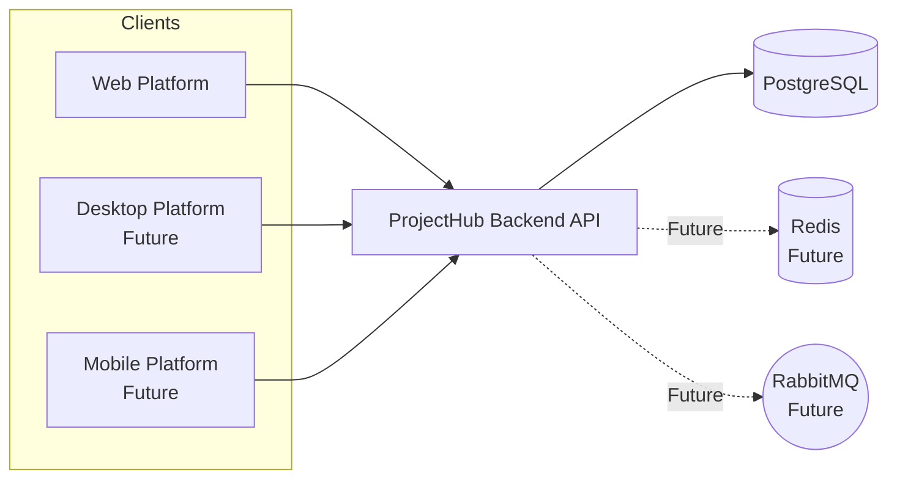
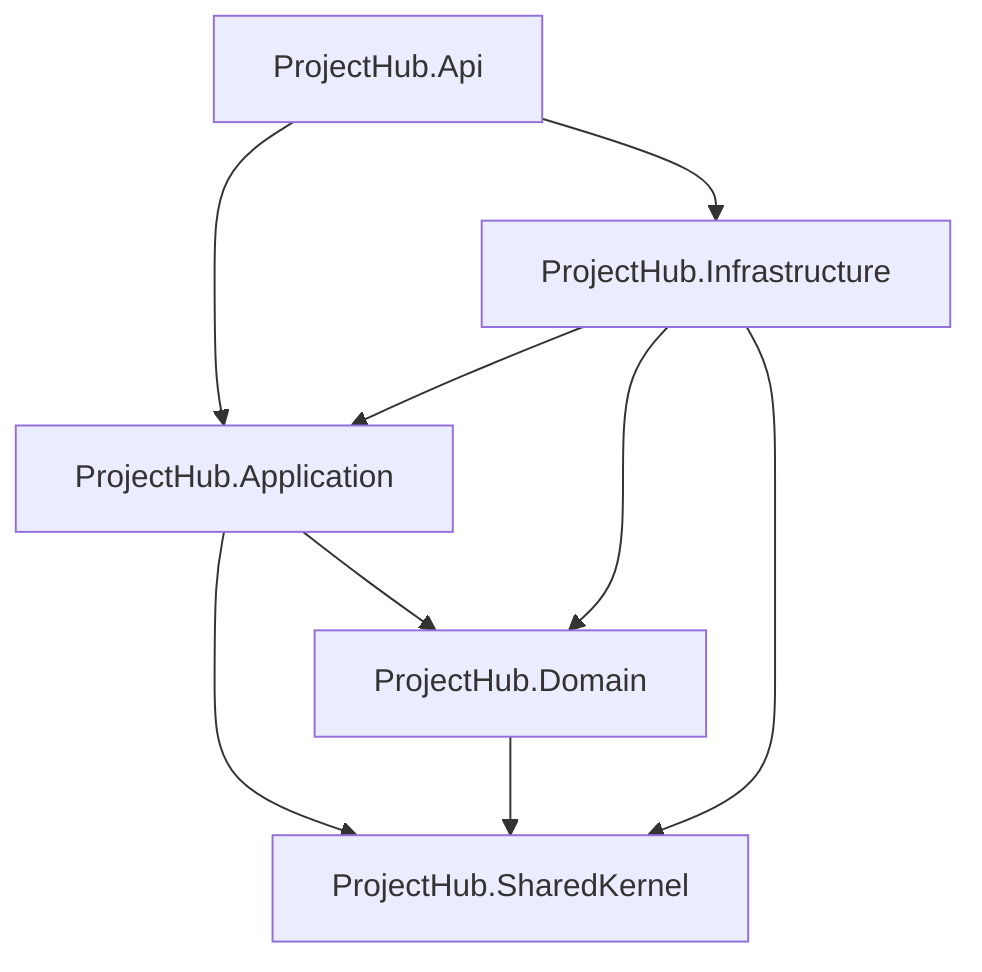
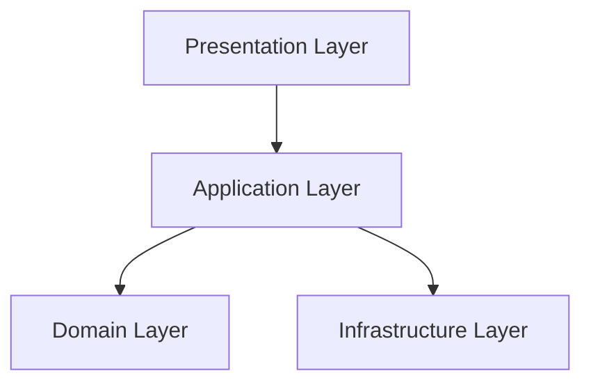
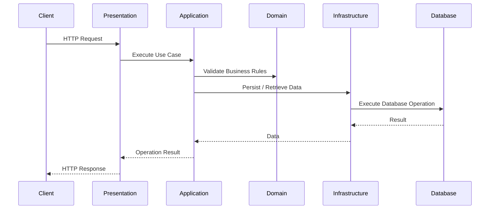
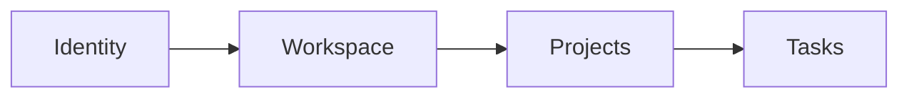
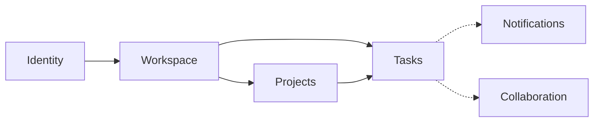
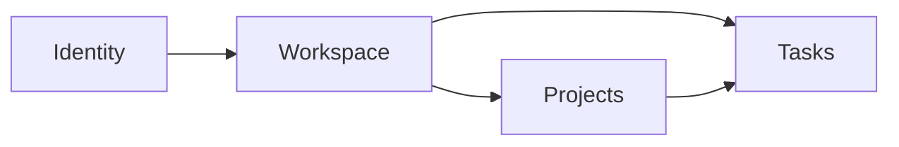

# ProjectHub Backend Architecture

> [!NOTE]
> This document defines the overall backend architecture of ProjectHub. It serves as the single source of truth for architectural decisions, system boundaries, technology choices, and development guidelines throughout the project lifecycle.

---

|**Project**     |ProjectHub           |
|----------------|---------------------|
|**Document**    |Backend Architecture |
|**Version**     |1.0.0                |
|**Status**      |Draft                |
|**Owner**       |Ngo Hoang Sang       |
|**Created**     |2026-07-06           |
|**Last Updated**|2026-07-06           |

---

## Table of Contents

1. Introduction
2. Project Goals
3. Architecture Style
4. High-Level Architecture
5. Solution Architecture
6. Layer Responsibilities
7. Module Design
8. Request Lifecycle
9. Data Flow
10. Dependency Rules
11. Design Principles
12. Cross-Cutting Concerns
13. Technology Stack
14. Scalability Strategy
15. Development Guidelines
16. Future Evolution

---

# 1. Introduction

> [!IMPORTANT]
> This section introduces the ProjectHub platfrom, explains the purpose of backend, defines the target audience, and establishes the scope of this architecture document.

## 1.1 Overview

ProjectHub is a cloud-native SaaS Project Management and Team Collaboration Platform designed to help individuals, teams, and organizations organize projects, manage tasks, and collaborate within a shared workspace.

The platform aims to provide a simple and centralized environment where users can plan work, monitor project progress, and collaborate more effectively without relying on multiple disconnected tools.

The first version of ProjectHub focuses on delivering a solid backend foundation with a modular architecture that supports future growth while remaining maintainable and easy to extend.

## 1.2 Purpose

The ProjectHub backend serves as the central service layer of the platform. It is responsible for processing business logic, managing application data, enforcing security, and exposing RESTful APIs for client applications.

The backend is designed with a modular architecture to support long-term maintainability, scalability, and future feature expansion while keeping the initial implementation simple and manageable.

## 1.3 Target Users

ProjectHub is designed to support different types of users with varying collaboration needs.

| User Type | Description |
|-----------|-------------|
| **Personal** | Individuals managing personal projects, tasks, and daily work. |
| **Team** | Small teams collaborating on shared projects and task management. |
| **Business** | Organizations managing multiple teams, projects, workspaces, and user roles. |

## 1.4 Scope

This document defines the overall architecture of the ProjectHub backend. It serves as the primary technical reference for architectural decisions and development practices throughout the project.

The document includes:

- Overall backend architecture
- Solution architecture
- Layer responsibilities
- Module organization
- Dependency rules
- Design principles
- Technology stack
- Development guidelines

The document does not include:

- Frontend architecture
- UI/UX design
- API specifications
- Database schema design
- Deployment procedures

These topics are documented separately as the project evolves.

## 1.5 Vision

The ProjectHub backend aims to provide a reliable and maintainable foundation for a modern SaaS application.

Rather than prioritizing rapid feature growth, the project emphasizes clean architecture, modular design, and sustainable development practices. This approach enables the platform to evolve gradually while maintaining code quality, scalability, and long-term maintainability.

# 2. Project Goals

> [!IMPORTANT]
> This section defines the primary objectives of the ProjectHub backend. These goals serve as the foundation for architectural decisions, technology selection, and future development throughout the project lifecycle.

---

## 2.1 Functional Goals

The backend is designed to provide the following core business capabilities:

| Goal | Description |
|------|-------------|
| **Identity Management** | Provide secure user registration, authentication, authorization, and account management. |
| **Workspace Management** | Support isolated workspaces for personal users, teams, and organizations. |
| **Project Management** | Enable users to create, organize, and manage projects throughout their lifecycle. |
| **Task Management** | Allow users to create, assign, prioritize, and track tasks within projects. |
| **Team Collaboration** | Support collaboration through comments, activity history, notifications, and member management. |
| **RESTful API Services** | Provide consistent and well-structured APIs for Web, Desktop, and Mobile applications. |

---

## 2.2 Non-Functional Goals

In addition to business functionality, the backend aims to satisfy the following quality attributes:

| Goal                | Description         |
|---------------------|---------------------|
| **Maintainability** | Keep the codebase clean, modular, and easy to understand for long-term development. |
| **Scalability** | Support future growth in users, projects, and features without major architectural changes. |
| **Security** | Protect user data through secure authentication, authorization, and data validation practices. |
| **Performance** | Deliver responsive API performance through efficient application design and optimized database access. |
| **Reliability** | Ensure predictable system behavior with proper error handling, logging, and monitoring capabilities. |
| **Extensibility** | Allow new modules and business features to be integrated with minimal impact on existing components. |

# 3. Architecture Style

> [!IMPORTANT]
> This section describes the architectural style adopted by the ProjectHub backend and explains the design decisions that support long-term maintainability, scalability, and sustainable development.

---

## 3.1 Architectural Approach

The ProjectHub backend adopts a **Modular Monolith** architecture.

The application is developed and deployed as a single application while being internally divided into independent business modules. Each module encapsulates its own responsibilities, business logic, and data access, allowing the system to remain organized as it grows.

This approach provides the simplicity of a monolithic deployment while encouraging a modular codebase that is easier to maintain and extend.

---

## 3.2 Why Modular Monolith

A Modular Monolith was selected because it provides the best balance between simplicity and maintainability for the current stage of the project.

The decision is based on the following considerations:

- The project is developed by a single developer.
- The initial focus is building a stable backend foundation rather than managing distributed systems.
- A single deployment simplifies development, testing, debugging, and deployment.
- Clearly separated modules reduce coupling and improve maintainability.
- The architecture allows future migration to microservices if business requirements justify the additional complexity.

---

## 3.3 Core Characteristics

The ProjectHub backend follows several architectural characteristics:

- **Modular** — Business features are organized into independent modules.
- **Layered** — Each module follows a clear separation between Presentation, Application, Domain, and Infrastructure.
- **API-First** — All functionality is exposed through RESTful APIs for multiple client applications.
- **Domain-Oriented** — Business logic is organized around business domains instead of technical concerns.
- **Dependency-Controlled** — Dependencies between layers and modules follow strict architectural rules.

---

## 3.4 Architectural Principles

The architecture is guided by the following principles:

- Separation of Concerns
- High Cohesion
- Low Coupling
- SOLID Principles
- Dependency Inversion
- Clean Architecture concepts
- Simplicity over unnecessary complexity

These principles help ensure that the backend remains maintainable, testable, and scalable throughout the project's lifecycle.

---

## 3.5 Evolution Strategy

The backend is designed to evolve incrementally rather than introducing unnecessary complexity from the beginning.

The expected architectural evolution is:

```text
Version 1
Modular Monolith
        │
        ▼
Caching (Redis)
        │
        ▼
Background Processing (RabbitMQ)
        │
        ▼
Additional Modules
        │
        ▼
Microservices (Only if Required)
```

Future architectural changes will be driven by actual business needs, system growth, and operational requirements instead of premature optimization.

# 4. High-Level Architecture

> [!IMPORTANT]
> This section presents a high-level view of the ProjectHub backend and illustrates how the major components interact within the system.

---

## 4.1 System Overview

ProjectHub follows a client-server architecture where multiple client applications communicate with a centralized backend through RESTful APIs.

The backend is responsible for handling business logic, authentication, authorization, data persistence, and communication with external services. Client applications remain lightweight by delegating business processing to the backend.

The initial release focuses on supporting the Web Platform. The architecture is designed to accommodate Desktop and Mobile applications in future versions without requiring significant changes to the backend.

---

## 4.2 Core Components

The ProjectHub platform consists of the following high-level components.

| Component | Responsibility |
|-----------|----------------|
| **Web Client** | Provides the primary user interface for interacting with the platform. |
| **Backend API** | Processes business logic and exposes RESTful APIs. |
| **PostgreSQL** | Stores application data and business entities. |
| **Redis** *(Future)* | Improves application performance through distributed caching. |
| **RabbitMQ** *(Future)* | Supports asynchronous processing and background tasks. |

---

## 4.3 External Services

The first version of ProjectHub minimizes external dependencies in order to keep the system simple and maintainable.

Future integrations may include:

- Email Service
- Cloud File Storage
- OAuth Providers
- Payment Gateway

These integrations will communicate with the backend through well-defined interfaces without affecting the core business modules.

---

## 4.4 Communication Flow

The general request flow within the system is illustrated below.

```text
Client Application
        │
        ▼
 RESTful API
        │
        ▼
Business Logic
        │
        ▼
 Data Access
        │
        ▼
 PostgreSQL
```

Future versions may introduce Redis and RabbitMQ to improve performance and support asynchronous processing where appropriate.

---

## 4.5 High-Level Diagram



---

## 4.6 Architectural Boundaries

The backend is responsible for all core business operations and serves as the central processing layer of the platform.

| Inside Backend | Outside Backend |
|----------------|-----------------|
| Business Logic | Client Applications |
| Authentication & Authorization | Email Services |
| Project & Task Management | Cloud Storage |
| Data Persistence | Payment Services |
| RESTful APIs | Third-party Integrations |

External systems communicate with the backend through APIs or dedicated integration layers. This separation ensures that business logic remains isolated from third-party dependencies.

# 5. Solution Architecture

> [!IMPORTANT] 
> This section outlines how to organize a solution using Clean Architecture combined with a modular monolith approach, helping you gain a better understanding of the solution's architecture.

## 5.1 Solution Overview

The ProjectHub backend is organized as a multi-project solution following the principles of Clean Architecture and a Modular Monolith.

Instead of placing all source code into a single project, the solution separates different technical responsibilities into dedicated projects. This structure improves maintainability, promotes clear dependency boundaries, and allows the codebase to evolve without becoming tightly coupled.

Each project has a well-defined responsibility and communicates with other projects through controlled dependencies. This organization helps keep business logic independent from infrastructure concerns while supporting long-term scalability and sustainable development.

## 5.2 Solution Structure

The ProjectHub backend is organized as a multi-project solution to achieve a clear separation of concerns while maintaining a simple deployment model.

The solution follows the principles of **Clean Architecture** and **Modular Monolith**. Technical responsibilities are separated into dedicated projects, while business features are organized using a **Feature-first (Vertical Slice)** approach within the Application layer.

```text
ProjectHub.sln
│
├── src
│   ├── ProjectHub.Api
│   ├── ProjectHub.Application
│   ├── ProjectHub.Domain
│   ├── ProjectHub.Infrastructure
│   └── ProjectHub.SharedKernel
│
├── tests
│   ├── ProjectHub.UnitTests
│   └── ProjectHub.IntegrationTests
│
└── docs
```

This structure keeps business logic independent from infrastructure concerns and provides a scalable foundation for future development.

Within the Application project, business functionality is organized by feature instead of technical layers. Each feature encapsulates its own commands, queries, handlers, validators, and DTOs, reducing coupling and improving maintainability.

Example:

```text
ProjectHub.Application
│
├── Identity
│   ├── Commands
│   ├── Queries
│   ├── DTOs
│   ├── Validators
│   └── Handlers
│
├── Workspace
│
├── Projects
│
└── Tasks
```

This organization enables each feature to evolve independently while maintaining a consistent project structure across the solution.

---

## 5.3 Project Responsibilities

Each project within the solution has a single, well-defined responsibility. This separation helps reduce coupling, improve maintainability, and establish clear architectural boundaries.

|            Project            |                                    Responsibility                                |
|-------------------------------|----------------------------------------------------------------------------------|
| **ProjectHub.Api**            | Entry point of the application. Handles HTTP requests, API endpoints, middleware, authentication, authorization, dependency injection, and application configuration. |
| **ProjectHub.Application**    | Contains application use cases, business workflows, commands, queries, handlers, validators, DTOs, and orchestration logic. Business features are organized using the Feature-first (Vertical Slice) approach. |
| **ProjectHub.Domain**         | Contains the core business model, including entities, value objects, domain events, repository interfaces, business rules, and domain services. This project has no dependency on external frameworks. |
| **ProjectHub.Infrastructure** | Implements infrastructure concerns such as Entity Framework Core, database persistence, authentication providers, caching, messaging, file storage, logging, and integrations with external services. |
| **ProjectHub.SharedKernel**   | Provides shared domain abstractions and reusable building blocks such as base entities, result types, domain primitives, common interfaces, and shared business concepts used across multiple modules. |

### Core Business Modules

The Application layer is divided into business modules that represent the primary capabilities of the platform.

|       Module      |                                Purpose                                    | Version |
|-------------------|---------------------------------------------------------------------------|---------|
| **Identity**      | User registration, authentication, authorization, and account management. |   V1    |
| **Workspace**     | Workspace creation, member management, and collaboration boundaries.      |   V1    |
| **Projects**      | Project lifecycle management and project organization.                    |   V1    | 
| **Tasks**         | Task creation, assignment, prioritization, and workflow management.       |   V1    |
| **Collaboration** | Comments, mentions, activity history, and team communication.             |   V2    |
| **Notifications** | In-app notifications, email notifications, and event delivery.            |   V2    |
| **Files**         | File upload, document management, and attachment support.                 |   V2    |
| **Reports**       | Dashboards, analytics, and project reporting.                             |   V2    |
| **Billing**       | Subscription plans, payments, and license management.                     |   V3    |
| **AI**            | AI-assisted task management and productivity features.                    |   V3    |

The Version column represents the planned introduction of each module and serves as a roadmap rather than a fixed implementation schedule.

## 5.4 Project References

The dependency relationships between projects follow the Dependency Inversion Principle and the rules of Clean Architecture. Each project may only reference projects that are explicitly allowed.



### Dependency Matrix

|         Project           |        Allowed References         |
|---------------------------|-----------------------------------|
| ProjectHub.Api            | Application, Infrastructure       |
| ProjectHub.Application    | Domain, SharedKernel              |
| ProjectHub.Domain         | SharedKernel                      |
| ProjectHub.Infrastructure | Application, Domain, SharedKernel |
| ProjectHub.SharedKernel   | None                              |

The dependency direction is intentionally restricted to prevent circular references and to maintain clear architectural boundaries between layers.

## 5.5 Folder Organization

Each project follows an internal folder structure based on its responsibility. This organization keeps the solution consistent and improves discoverability as the codebase grows.

### ProjectHub.Api

```text
Controllers
Middlewares
Configurations
Extensions
Filters
OpenApi
```

### ProjectHub.Application

```text
Identity
Workspace
Projects
Tasks

Behaviors
Abstractions
DependencyInjection
```

Each business feature follows the Vertical Slice Architecture.

```text
Projects

Commands

Queries

DTOs

Validators

Handlers
```

### ProjectHub.Domain

```text
Entities
ValueObjects
Enums
Events
Repositories
Specifications
Services
```

### ProjectHub.Infrastructure

```text
Persistence
Authentication
Caching
Messaging
Storage
Logging
BackgroundJobs
```

### ProjectHub.SharedKernel

```text
Entities
Primitives
Interfaces
Results
Errors
DomainEvents
```

The folder organization may evolve over time as new business requirements emerge, but each project should preserve its primary responsibility.

## 5.6 Solution Principles

The following principles guide the development and evolution of the ProjectHub backend.

### Single Responsibility

Each project is responsible for a single architectural concern and should not contain unrelated functionality.

### Separation of Concerns

Business logic, infrastructure, presentation, and domain models remain separated to improve maintainability and testability.

### Dependency Direction

Dependencies must always point inward toward the business core. Circular dependencies between projects are not allowed.

### Feature-first Organization

Business functionality is organized by feature rather than technical layers. Each feature owns its commands, queries, handlers, validators, and DTOs.

### Framework Independence

The Domain layer should remain independent from ASP.NET Core, Entity Framework Core, or any external framework whenever possible.

### Explicit Dependencies

Project dependencies should be visible and intentional. Hidden or implicit coupling should be avoided.

### Extensibility

The solution should support adding new business modules without requiring significant changes to existing modules.

### Simplicity First

Architecture decisions should prioritize clarity and maintainability over unnecessary complexity. New technologies or patterns should only be introduced when they solve a real problem.

# 6. Layer Responsibilities

> [!IMPORTANT]
> This section defines the responsibility of each architectural layer within the ProjectHub backend. It explains the role, boundaries, and interactions of each layer to ensure a clear separation of concerns and maintain a maintainable, scalable, and testable architecture.

## 6.1 Layer Overview

The ProjectHub backend is organized into four logical layers, each with a distinct responsibility within the request processing pipeline.

Rather than combining all application logic into a single layer, responsibilities are distributed to ensure that business rules remain independent from presentation and infrastructure concerns.

Each layer communicates only with the layers that it is allowed to depend on, following the dependency rules defined in the solution architecture.



The following sections describe the responsibility of each layer and explain how they collaborate to process application requests.

## 6.2 Presentation Layer

The Presentation Layer is the entry point of the backend system. It is responsible for receiving HTTP requests, validating input, authenticating users, authorizing access, and returning standardized HTTP responses.

This layer does not contain business rules or application workflows. Instead, it delegates all business operations to the Application Layer while remaining focused on communication between clients and the backend.

### Responsibilities

- Receive and process HTTP requests.
- Perform request model binding and validation.
- Authenticate and authorize incoming requests.
- Invoke application use cases.
- Convert application results into standardized HTTP responses.
- Handle API versioning, middleware, and endpoint configuration.

### Out of Scope

The Presentation Layer must not:

- Contain business rules.
- Access the database directly.
- Implement business workflows.
- Contain infrastructure-specific logic.

Keeping the Presentation Layer lightweight ensures that the API remains easy to maintain, test, and evolve independently from the core business logic.

## 6.4 Domain Layer

The Domain Layer represents the core business of the ProjectHub platform. It contains the business model, business rules, and domain concepts that define how the system behaves, independent of any external technologies or frameworks.

This layer should remain stable over time and must not depend on ASP.NET Core, Entity Framework Core, databases, messaging systems, or any infrastructure-specific implementation.

### Responsibilities

- Define domain entities.
- Implement business rules and invariants.
- Model value objects and domain events.
- Declare repository interfaces.
- Encapsulate domain-specific behaviors.
- Protect business consistency across the application.

### Out of Scope

The Domain Layer must not:

- Access databases.
- Execute SQL queries.
- Handle HTTP requests.
- Depend on ASP.NET Core or Entity Framework Core.
- Send emails or notifications.
- Contain application workflows.

Keeping the Domain Layer independent ensures that business rules remain reusable, testable, and unaffected by infrastructure or presentation changes.

## 6.5 Infrastructure Layer

The Infrastructure Layer provides the technical implementation required by the application. It is responsible for communicating with external systems, persisting data, and implementing abstractions defined by the Domain or Application layers.

This layer contains framework-specific code and may change over time as technologies evolve without affecting the core business logic.

### Responsibilities

- Implement repository interfaces.
- Persist application data using Entity Framework Core.
- Configure database access and migrations.
- Implement authentication and authorization providers.
- Integrate caching, messaging, and file storage services.
- Provide logging, monitoring, and background processing.

### Out of Scope

The Infrastructure Layer must not:

- Define business rules.
- Implement application workflows.
- Contain presentation logic.
- Modify domain behavior.
- Become a central location for unrelated utilities.

Infrastructure should remain an implementation detail of the architecture, allowing external technologies to be replaced with minimal impact on the business core.

## 6.6 Layer Interaction

The architectural layers collaborate in a well-defined sequence to process each client request. Every layer has a specific responsibility and communicates only with the layers required to complete the current use case.

The Presentation Layer receives the incoming HTTP request and delegates the business operation to the Application Layer. The Application Layer coordinates the execution of the use case, invokes domain logic when necessary, and interacts with infrastructure services through abstractions.

The Domain Layer evaluates business rules and protects business consistency without any knowledge of external technologies. When data persistence or external communication is required, the Infrastructure Layer provides the concrete implementation while remaining transparent to the business core.

The processed result is returned through the same path until a standardized HTTP response is sent back to the client.



### Interaction Principles

- Requests always enter through the Presentation Layer.
- Business workflows are coordinated by the Application Layer.
- Business rules are evaluated by the Domain Layer.
- External systems are accessed only through the Infrastructure Layer.
- Layers communicate through well-defined abstractions and dependency boundaries.

# 7. Module Design

> [!IMPORTANT]
> This section defines the business modules of the ProjectHub backend. Each module represents a distinct business capability with clear ownership, responsibilities, and boundaries. By organizing the system into independent modules, the architecture remains maintainable, scalable, and easier to evolve as new business requirements emerge.

## 7.1 Module Overview

The ProjectHub backend is organized into a set of business-oriented modules. Each module encapsulates a specific business capability and is responsible for managing its own application logic, domain rules, and data access.

Unlike traditional layered architectures that organize code by technical concerns, ProjectHub adopts a **Feature-first (Vertical Slice)** approach. This means business functionality is grouped by domain rather than by controllers, services, or repositories.

The first release (V1) focuses on four core modules that provide the minimum functionality required for a collaborative project management platform. Additional modules will be introduced in future versions as the platform evolves.



### Core Modules

| Module | Primary Responsibility | Planned Version |
|----------|------------------------|-----------------|
| **Identity** | User authentication, authorization, account management, and security. | V1 |
| **Workspace** | Workspace creation, membership management, roles, and collaboration boundaries. | V1 |
| **Projects** | Project lifecycle management, organization, and project settings. | V1 |
| **Tasks** | Task management, assignment, prioritization, and workflow execution. | V1 |

### Future Modules

| Module | Primary Responsibility | Planned Version |
|----------|------------------------|-----------------|
| **Collaboration** | Comments, mentions, and activity timeline. | V2 |
| **Notifications** | In-app notifications, email notifications, and event delivery. | V2 |
| **Files** | File upload, attachment management, and document storage. | V2 |
| **Reports** | Dashboards, analytics, and reporting capabilities. | V2 |
| **Billing** | Subscription management, licensing, and payment processing. | V3 |
| **AI** | AI-assisted productivity features and intelligent automation. | V3 |

Each module is designed to be highly cohesive and loosely coupled. Modules communicate through well-defined interfaces and application contracts, allowing the platform to grow without introducing unnecessary dependencies between business domains.

## 7.2 Identity Module

### Overview

The Identity module is responsible for authentication, authorization, and account management. It serves as the security foundation of the ProjectHub platform by ensuring that only authenticated and authorized users can access protected resources.

Every user interaction with the platform begins with the Identity module, making it one of the core modules of the system.

### Responsibilities

- User registration.
- User authentication.
- JWT access token generation.
- Refresh token management.
- Role and permission management.
- Password management.
- User profile management.

### Core Components

The Identity module consists of several logical components working together to provide secure access to the platform.

| Component | Responsibility |
|-----------|----------------|
| Authentication | Verify user credentials and issue access tokens. |
| Authorization | Control access to protected resources based on roles and permissions. |
| User Management | Maintain user accounts and profile information. |
| Token Management | Generate, validate, and refresh JWT tokens. |

### Dependencies

The Identity module is independent from other business modules. Other modules may depend on Identity to determine the current user or verify permissions, but Identity should not depend on business-specific modules such as Projects or Tasks.

### Future Evolution

Future versions may introduce additional security capabilities, including:

- Multi-Factor Authentication (MFA)
- External OAuth providers
- Single Sign-On (SSO)
- Account verification
- Password recovery
- Security audit logging

## 7.3 Workspace Module

### Overview

The Workspace module provides the collaboration boundary of the ProjectHub platform. A workspace represents an isolated environment where users can organize projects, manage members, and collaborate as a team.

Every project belongs to a workspace, and all collaboration activities are scoped within its boundaries.

### Responsibilities

- Workspace creation.
- Workspace configuration.
- Member invitation and management.
- Role assignment.
- Workspace ownership management.
- Permission boundaries.

### Core Components

| Component | Responsibility |
|-----------|----------------|
| Workspace Management | Create, update, archive, and manage workspaces. |
| Member Management | Invite, remove, and organize workspace members. |
| Role Management | Assign roles and control workspace permissions. |
| Access Control | Ensure users only access authorized workspaces. |

### Dependencies

The Workspace module depends on the Identity module for user authentication and user information. It provides the collaboration context for higher-level modules such as Projects and Tasks.

### Future Evolution

Future versions may include:

- Organization support
- Team grouping
- Workspace templates
- Guest users
- Workspace branding
- Advanced permission management

## 7.4 Projects Module

### Overview

The Projects module is responsible for managing the lifecycle of projects within a workspace. It provides the organizational structure for planning, tracking, and coordinating work while serving as the parent context for tasks and other project-related resources.

Each project belongs to a single workspace and acts as the primary container for task management and team collaboration.

### Responsibilities

- Create and manage projects.
- Update project information.
- Archive and restore projects.
- Manage project visibility and status.
- Organize project members.
- Maintain project-level settings.

### Core Components

| Component | Responsibility |
|-----------|----------------|
| Project Management | Create, update, archive, and manage projects. |
| Project Settings | Configure project properties and preferences. |
| Project Membership | Manage project participants and their access. |
| Project Lifecycle | Control project states throughout its lifecycle. |

### Dependencies

The Projects module depends on the Workspace module to provide the collaboration context and permission boundaries. It serves as the parent module for the Tasks module, which manages work items within each project.

### Future Evolution

Future versions may introduce:

- Project templates
- Custom project workflows
- Labels and categories
- Project milestones
- Project favorites
- Project dashboards

## 7.5 Tasks Module

### Overview

The Tasks module manages individual work items within a project. It provides the core functionality for planning, assigning, tracking, and completing work while supporting team collaboration throughout the project lifecycle.

Tasks represent the primary unit of work in the ProjectHub platform and form the foundation of day-to-day project execution.

### Responsibilities

- Create and manage tasks.
- Assign tasks to members.
- Track task status.
- Manage priorities.
- Organize due dates.
- Monitor task progress.

### Core Components

| Component | Responsibility |
|-----------|----------------|
| Task Management | Create, update, archive, and organize tasks. |
| Assignment | Assign tasks to workspace members. |
| Workflow | Control task status transitions throughout the workflow. |
| Scheduling | Manage due dates, deadlines, and timelines. |

### Dependencies

The Tasks module depends on both the Workspace and Projects modules. Every task belongs to a project, while user permissions and assignments are validated within the corresponding workspace.

### Future Evolution

Future versions may introduce:

- Subtasks
- Recurring tasks
- Task dependencies
- Time tracking
- Kanban boards
- Sprint management
- Task templates
- Automation rules

## 7.6 Future Modules

The ProjectHub architecture is designed to support incremental growth through additional business modules without requiring significant changes to the existing system.

The following modules are planned for future releases:

| Module | Description | Planned Version |
|----------|-------------|-----------------|
| Collaboration | Comments, mentions, and activity timeline. | V2 |
| Notifications | In-app notifications, email notifications, and event delivery. | V2 |
| Files | File upload, attachment management, and document storage. | V2 |
| Reports | Dashboards, analytics, and reporting capabilities. | V2 |
| Billing | Subscription plans, licensing, and payment processing. | V3 |
| AI | AI-assisted productivity features and workflow automation. | V3 |

Each new module should follow the same architectural principles established by the existing modules, ensuring high cohesion, low coupling, and clear ownership of business responsibilities.

## 7.7 Module Communication

Modules communicate through well-defined application contracts rather than directly accessing each other's internal implementation.

Business modules should remain independent whenever possible and expose only the functionality required by other modules.



### Communication Principles

- Modules communicate through application services or interfaces.
- Direct access to another module's internal implementation should be avoided.
- Circular dependencies between modules are not allowed.
- Business rules remain within the owning module.
- Cross-module interactions should be explicit and minimal.

Following these principles allows each module to evolve independently while preserving the overall integrity of the system architecture.

## 8.

...

## 9.

...

# 10. Dependency Rules

> [!IMPORTANT]
> This section defines the dependency rules that govern the ProjectHub backend architecture. These rules establish clear boundaries between projects, layers, and business modules to prevent tight coupling, circular dependencies, and architecture erosion throughout the system's evolution.

## 10.1 Dependency Overview

ProjectHub follows the Dependency Inversion Principle to ensure that high-level business logic remains independent from low-level implementation details.

Dependencies are intentionally restricted to preserve architectural boundaries and to keep the business core isolated from infrastructure concerns.

The following diagram illustrates the allowed dependency direction between projects.


All project references must follow the dependency direction shown above. Any dependency outside these rules should be considered an architectural violation.

## 10.2 Project Dependencies

Each project has a clearly defined dependency scope.

| Project | Allowed References |
|----------|--------------------|
| ProjectHub.Api | Application, Infrastructure |
| ProjectHub.Application | Domain, SharedKernel |
| ProjectHub.Domain | SharedKernel |
| ProjectHub.Infrastructure | Application, Domain, SharedKernel |
| ProjectHub.SharedKernel | None |

Projects must not introduce additional references beyond those defined above. This ensures that the solution remains modular, maintainable, and free from circular dependencies.

## 10.3 Layer Dependencies

Dependencies between architectural layers must always follow the inward dependency rule.

```mermaid
flowchart TD

Presentation

↓

Application

↓

Domain

Application --> Infrastructure
```

### Allowed

- Presentation → Application
- Presentation → Infrastructure
- Application → Domain
- Application → Infrastructure (through abstractions)
- Domain → SharedKernel

### Not Allowed

- Domain → Application
- Domain → Infrastructure
- Infrastructure → Presentation
- Circular dependencies between layers

## 10.4 Module Dependencies

Business modules should remain highly cohesive and loosely coupled.

The dependency relationships between the core modules are illustrated below.



### Rules

- Identity must remain independent from business modules.
- Workspace provides the collaboration boundary.
- Projects depend on Workspace.
- Tasks depend on Projects and Workspace.
- Modules should communicate through application contracts rather than directly accessing each other's implementation.

## 10.5 Dependency Principles

The following principles apply to every new project, module, and feature introduced into the solution.

### Inward Dependencies

Dependencies should always point toward the business core.

### No Circular Dependencies

Projects and modules must never reference each other in a circular manner.

### Explicit Dependencies

Every dependency should be intentional, documented, and visible through project references or dependency injection.

### Abstraction First

High-level modules should depend on abstractions rather than concrete implementations.

### Low Coupling

Modules should minimize knowledge of other modules and communicate only when necessary.

### High Cohesion

Each module should encapsulate a single business capability and own its related logic.

### Dependency Injection

External services should be resolved through dependency injection instead of direct object creation.

### Framework Isolation

Business logic should remain independent from framework-specific implementations whenever possible.