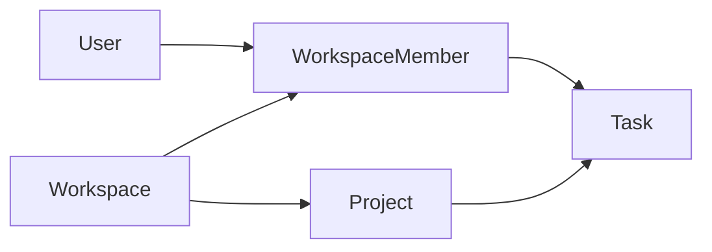

# ProjectHub Database Design

> [!NOTE]
> This document defines the database architecture of ProjectHub. It serves as the primary reference for data modeling, relational design, naming conventions, and persistence strategies before implementation begins.

---

| **Project** | ProjectHub |
|--------------|------------|
| **Document** | Database Design |
| **Version** | 1.0.0 |
| **Status** | Draft |
| **Owner** | Ngo Hoang Sang |
| **Created** | 2026-07-07 |
| **Last Updated** | 2026-07-07 |

---

## Table of Contents

1. Introduction
2. Database Goals
3. Database Architecture
4. Core Entities
5. Naming Conventions
6. Primary Key Strategy
7. Foreign Key Strategy
8. Index Strategy
9. Audit Strategy
10. Migration Strategy
11. Future Evolution

---

# 1. Introduction

> [!IMPORTANT]
> This section introduces the ProjectHub database architecture, explains its purpose, establishes the design philosophy, and defines the scope of this document. It serves as the foundation for all future database implementation and evolution.

---

## 1.1 Overview

The ProjectHub database is the central persistence layer of the platform. It is responsible for storing, organizing, and protecting application data while maintaining consistency, integrity, and reliability throughout the system.

The database follows a relational model based on PostgreSQL and is designed to support the modular backend architecture defined in the architecture documentation. Each business module owns its corresponding data while maintaining well-defined relationships through foreign keys and database constraints.

The initial version emphasizes a clean, normalized schema that is easy to understand, maintain, and extend. As the platform evolves, the database architecture is expected to grow incrementally without requiring major structural redesign.

---

## 1.2 Purpose

The primary purpose of the ProjectHub database is to provide a reliable and maintainable persistence layer for all business data within the platform.

This document establishes the architectural guidelines for designing the database before implementation begins. It defines the overall data organization, design decisions, naming conventions, key strategies, and persistence principles that every future database change should follow.

By documenting these decisions early, the project reduces architectural inconsistencies and provides a single source of truth for future database development.

---

## 1.3 Design Principles

The ProjectHub database is designed according to several core principles that guide every architectural decision throughout the project's lifecycle.

### Relational First

The system adopts a relational database model to ensure strong consistency, data integrity, and clear relationships between business entities.

### Normalization

The schema is normalized to minimize data duplication and maintain a single source of truth for every business concept.

### Simplicity

The first version intentionally avoids unnecessary complexity. Only the structures required by current business requirements are introduced, while keeping future expansion in mind.

### Maintainability

The database should remain easy to understand, modify, and extend as new modules and business requirements are introduced.

### Scalability

The architecture is designed to support future optimization strategies such as indexing improvements, partitioning, read replicas, and horizontal scaling without requiring significant redesign.

---

## 1.4 Scope

This document covers the logical database architecture of the ProjectHub backend.

It includes:

- Overall database architecture.
- Core business entities.
- Naming conventions.
- Primary and foreign key strategies.
- Indexing strategy.
- Audit field strategy.
- Migration strategy.
- Long-term database evolution.

The following topics are intentionally outside the scope of this document:

- Entity Framework Core implementation.
- SQL scripts.
- Database migrations.
- Stored procedures.
- Database administration.
- Backup and recovery procedures.
- Infrastructure deployment.

These implementation details will be documented separately as part of the persistence layer implementation.

---

## 1.5 Vision

The long-term vision of the ProjectHub database is to provide a stable and scalable data foundation that supports continuous product evolution without sacrificing maintainability.

As additional modules such as Notifications, Collaboration, Files, Reporting, Billing, and AI are introduced, the database should evolve through incremental changes rather than disruptive redesign.

The architecture aims to preserve data integrity, encourage modular ownership of data, and provide a reliable persistence layer capable of supporting both current and future business requirements.

# 2. Database Goals

> [!IMPORTANT]
> This section defines the primary objectives of the ProjectHub database architecture. These goals guide all future database design decisions and ensure that the persistence layer remains consistent, maintainable, secure, and scalable throughout the system's lifecycle.

---

## 2.1 Data Integrity

The database must ensure that all stored data remains accurate, consistent, and reliable.

Relationships between entities should be protected through primary keys, foreign keys, unique constraints, and transactional consistency. Invalid or orphaned data should be prevented whenever possible.

Maintaining data integrity is considered the highest priority of the database architecture.

---

## 2.2 Maintainability

The database should remain easy to understand, modify, and extend throughout the project's lifecycle.

A consistent naming convention, normalized schema, and modular entity organization help reduce complexity and simplify future development.

Every structural change should be predictable, well-documented, and implemented through controlled database migrations.

---

## 2.3 Scalability

The database architecture should support future growth without requiring significant redesign.

As ProjectHub expands with additional modules and increasing amounts of data, the schema should continue to support efficient querying, indexing, and future optimization strategies.

The initial version focuses on vertical scalability while keeping the architecture prepared for future horizontal expansion if required.

---

## 2.4 Performance

The database should provide efficient data access while maintaining strong consistency.

Frequently accessed data should be optimized through appropriate indexing strategies and efficient relational design.

Performance optimizations should be introduced only when supported by measurable requirements rather than premature optimization.

---

## 2.5 Security

The database should protect sensitive business information and user data.

Sensitive information should never be stored in plain text. Authentication-related data, personal information, and security credentials must follow industry best practices for storage and protection.

Access to database resources should always be controlled through the application layer.

---

## 2.6 Consistency

ProjectHub prioritizes strong consistency over eventual consistency for core business operations.

Transactions should guarantee that related operations either succeed together or fail together, ensuring that the system never enters an invalid business state.

This approach simplifies business logic and improves data reliability.

---

## 2.7 Extensibility

The database should support the addition of new business modules with minimal impact on existing structures.

Future modules such as Collaboration, Notifications, Files, Reports, Billing, and AI should integrate into the existing schema through incremental extensions rather than structural redesign.

This enables continuous product evolution while preserving existing business data.

---

## 2.8 Long-Term Sustainability

The ProjectHub database is designed as a long-term foundation rather than a short-term implementation.

Architectural decisions prioritize readability, stability, and maintainability over unnecessary complexity.

As the platform evolves, the database should continue to serve as a reliable persistence layer capable of supporting future business requirements without compromising data quality or architectural consistency.

# 3. Database Architecture

> [!IMPORTANT]
> This section describes the overall architecture of the ProjectHub database. It explains the selected database model, the organization of business data, the persistence strategy, and the architectural decisions that guide future implementation.

## 3.1 Architecture Overview

ProjectHub adopts a relational database architecture centered around PostgreSQL as the primary persistence engine.

The database is designed to support the modular backend architecture by organizing business data into logical domains while maintaining strong relationships through relational constraints.

Rather than optimizing for short-term implementation speed, the database emphasizes long-term maintainability, consistency, and scalability.

Business entities are organized according to business capabilities rather than technical layers, ensuring that each module owns its data and evolves independently whenever possible.

The database architecture follows a single-database approach for the initial version, providing transactional consistency and simplifying development. Future versions may introduce additional persistence technologies if business requirements justify the added complexity.

flowchart LR

Application["Application Layer"]
    --> Persistence["Entity Framework Core"]

Persistence
    --> PostgreSQL["PostgreSQL Database"]

PostgreSQL
    --> Identity["Identity Data"]

PostgreSQL
    --> Workspace["Workspace Data"]

PostgreSQL
    --> Projects["Projects Data"]

PostgreSQL
    --> Tasks["Tasks Data"]

## 3.2 Database Model

ProjectHub uses a relational database model to represent business entities and their relationships.

The relational model was selected because it provides:

- Strong data consistency.
- ACID-compliant transactions.
- Referential integrity through foreign keys.
- Efficient querying for structured business data.
- Mature tooling and ecosystem support.

The initial schema follows normalization principles to reduce redundancy and preserve a single source of truth for every business entity.

Denormalization is intentionally avoided during the first version and will only be introduced when supported by measurable performance requirements.

## 3.3 Database Organization

The database is organized around business modules rather than technical components.

Each module owns its corresponding entities while maintaining explicit relationships with other modules through foreign key constraints.

The initial version consists of four primary business domains:

- Identity
- Workspace
- Projects
- Tasks

This organization improves maintainability by reducing coupling between unrelated business areas while preserving a clear and consistent data model.

Future modules will extend the existing schema without altering the ownership of established business domains whenever possible.

## 3.4 Persistence Strategy

ProjectHub follows the Code First development approach using Entity Framework Core.

The domain model serves as the primary source of truth, while database schema changes are managed through version-controlled migrations.

All schema modifications should be implemented through migration scripts to ensure consistent database evolution across different development environments.

Direct manual modifications to the production database schema should be avoided whenever possible.

## 3.5 Design Decisions

The following architectural decisions define the foundation of the ProjectHub database.

| Decision | Description |
|----------|-------------|
| Database Engine | PostgreSQL |
| Database Model | Relational Database |
| ORM | Entity Framework Core |
| Development Approach | Code First |
| Schema Management | EF Core Migrations |
| Data Integrity | Foreign Keys & Constraints |
| Transactions | ACID Transactions |
| Organization | Business Module Oriented |
| Initial Deployment | Single Database |
| Future Scalability | Read Replicas, Partitioning, Horizontal Scaling |

# 4. Core Entities

> [!IMPORTANT]
> This section defines the core business entities of the ProjectHub database. Each entity represents a distinct business concept and owns its corresponding data within the persistence layer. The purpose of this section is to establish clear ownership and responsibilities before designing relationships or database schemas.

## 4.1 Entity Overview

The ProjectHub database is organized around business entities rather than technical components.

Each entity represents a core concept within the platform and is responsible for storing business information required by a specific module.

The first release (V1) consists of five primary entities that form the foundation of the entire application.

| Entity | Module | Responsibility |
|---------|--------|----------------|
| User | Identity | Stores user account and authentication information. |
| Workspace | Workspace | Represents an isolated collaboration environment. |
| WorkspaceMember | Workspace | Defines membership and roles within a workspace. |
| Project | Projects | Organizes work inside a workspace. |
| Task | Tasks | Represents individual work items within a project. |

These entities establish the minimum data model required for the first version of ProjectHub. Additional entities will be introduced incrementally as new business capabilities become available.

## 4.2 Identity Domain

The Identity domain manages user accounts and platform authentication.

### User

The User entity represents an individual account within the ProjectHub platform.

Responsibilities:

- Store account information.
- Support authentication and authorization.
- Own personal profile information.
- Serve as the identity reference for other business modules.

Ownership:

- Identity Module

Future Expansion:

- Refresh Tokens
- External Login Providers
- Multi-Factor Authentication
- User Preferences

## 4.3 Workspace Domain

The Workspace domain defines the collaboration boundary of the platform.

### Workspace

The Workspace entity represents an isolated environment where users collaborate on projects.

Responsibilities:

- Store workspace information.
- Define collaboration boundaries.
- Own projects.
- Manage workspace configuration.

### WorkspaceMember

The WorkspaceMember entity represents a user's membership within a workspace.

Responsibilities:

- Connect users and workspaces.
- Store workspace roles.
- Define permissions.
- Maintain membership status.

Ownership:

- Workspace Module

Future Expansion:

- Invitations
- Guest Members
- Teams
- Departments

## 4.4 Projects Domain

The Projects domain manages the lifecycle of projects inside a workspace.

### Project

The Project entity serves as the organizational container for tasks and project-related resources.

Responsibilities:

- Store project information.
- Organize work.
- Maintain project lifecycle.
- Support project configuration.

Ownership:

- Projects Module

Future Expansion:

- Labels
- Milestones
- Templates
- Categories

## 4.5 Tasks Domain

The Tasks domain manages individual work items.

### Task

The Task entity represents a unit of work assigned to one or more workspace members.

Responsibilities:

- Store task information.
- Track progress.
- Support assignments.
- Manage scheduling.

Ownership:

- Tasks Module

Future Expansion:

- Subtasks
- Dependencies
- Time Tracking
- Automation
- Recurring Tasks

## 4.6 Future Entities

Future releases of ProjectHub will introduce additional entities as new business capabilities become available.

| Entity | Module | Planned Version |
|----------|--------|-----------------|
| Comment | Collaboration | V2 |
| Notification | Notifications | V2 |
| Attachment | Files | V2 |
| ActivityLog | Collaboration | V2 |
| Report | Reports | V2 |
| Subscription | Billing | V3 |
| Invoice | Billing | V3 |
| AIConversation | AI | V3 |

The current database architecture is intentionally designed to accommodate these entities through incremental schema evolution while preserving the stability of the existing data model.

# 5. Naming Conventions

> [!IMPORTANT]
> This section defines the naming conventions used throughout the ProjectHub database. Consistent naming improves readability, maintainability, and collaboration across the development team.

## 5.1 General Principles

The database follows consistent and predictable naming conventions to simplify development and reduce ambiguity.

The conventions apply to tables, columns, indexes, constraints, and database objects.

## 5.2 Naming Rules

| Object | Convention | Example |
|----------|------------|---------|
| Tables | PascalCase (Singular) | User, Workspace |
| Columns | PascalCase | CreatedAt |
| Primary Keys | Id | Id |
| Foreign Keys | EntityNameId | WorkspaceId |
| Indexes | IX_Table_Column | IX_User_Email |
| Unique Constraints | UX_Table_Column | UX_User_Email |
| Foreign Keys | FK_Source_Target | FK_Task_Project |

## 5.3 Principles

- Use meaningful names.
- Avoid abbreviations.
- Keep names consistent.
- Use singular entity names.
- Maintain naming consistency across all modules.

# 6. Primary Key Strategy

> [!IMPORTANT]
> This section defines how primary keys are generated and managed across the ProjectHub database.

## 6.1 Strategy

Every entity owns a single primary key.

Primary keys uniquely identify each record and remain immutable throughout the entity's lifetime.

## 6.2 Key Type

ProjectHub adopts **UUID Version 7** as the primary key strategy for all business entities.

Reasons include:

- Globally unique identifiers.
- Better scalability for distributed systems.
- Reduced exposure of sequential identifiers.
- Improved insertion performance compared to random UUID versions.

## 6.3 Rules

- Every entity must have exactly one primary key.
- Primary keys must never change.
- Business data must never be used as a primary key.
- All relationships reference primary keys only.

# 7. Foreign Key Strategy

> [!IMPORTANT]
> This section defines how relationships between entities are established and protected.

## 7.1 Relationship Principles

Relationships are enforced through foreign key constraints to preserve referential integrity.

Every foreign key must reference an existing primary key.

## 7.2 Delete Behavior

| Relationship | Delete Behavior |
|--------------|-----------------|
| User → WorkspaceMember | Cascade |
| Workspace → Project | Cascade |
| Project → Task | Cascade |
| Workspace → WorkspaceMember | Cascade |

Delete behavior should always reflect business rules rather than implementation convenience.

## 7.3 Principles

- Avoid orphan records.
- Enforce referential integrity.
- Use cascading deletes only when appropriate.
- Prefer explicit business rules over database shortcuts.

# 8. Index Strategy

> [!IMPORTANT]
> This section defines the indexing strategy used to improve query performance while maintaining efficient write operations.

## 8.1 Goals

Indexes should improve query performance without introducing unnecessary maintenance overhead.

## 8.2 Index Types

ProjectHub primarily uses:

- Primary Key Index
- Unique Index
- Composite Index

Additional indexes should only be introduced when supported by performance analysis.

## 8.3 Principles

- Index frequently queried columns.
- Avoid duplicate indexes.
- Review indexes as the application evolves.
- Optimize based on real usage patterns.

# 9. Audit Strategy

> [!IMPORTANT]
> This section defines how audit information is stored to support traceability and operational monitoring.

## 9.1 Standard Audit Fields

Every business entity should support common audit information whenever applicable.

Typical audit fields include:

- CreatedAt
- CreatedBy
- UpdatedAt
- UpdatedBy

Soft deletion may be introduced for selected entities in future versions.

## 9.2 Goals

Audit information enables:

- Change tracking.
- Operational transparency.
- Easier debugging.
- Historical analysis.

# 10. Migration Strategy

> [!IMPORTANT]
> This section defines how database schema changes are managed throughout the project lifecycle.

## 10.1 Code First

ProjectHub adopts the Code First approach using Entity Framework Core.

The domain model serves as the source of truth for the database schema.

## 10.2 Migration Principles

- All schema changes must be version controlled.
- Every structural change must be introduced through migrations.
- Manual schema modifications should be avoided.
- Database evolution must remain reproducible across environments.

## 10.3 Benefits

This approach provides:

- Consistent schema evolution.
- Better collaboration.
- Version history.
- Reliable deployment.

# 11. Future Evolution

> [!IMPORTANT]
> This section outlines the long-term direction of the ProjectHub database architecture.

## 11.1 Future Modules

The database is designed to support future business capabilities, including:

- Collaboration
- Notifications
- File Management
- Reporting
- Billing
- AI Features

## 11.2 Scalability

Future improvements may include:

- Read Replicas
- Table Partitioning
- Query Optimization
- Caching Integration
- Horizontal Scaling

These enhancements should be introduced incrementally as business requirements evolve.

## 11.3 Conclusion

The ProjectHub database architecture establishes a maintainable and scalable foundation for the platform.

By following consistent design principles, naming conventions, and persistence strategies, the database can evolve alongside the application while preserving data integrity, performance, and long-term maintainability.

